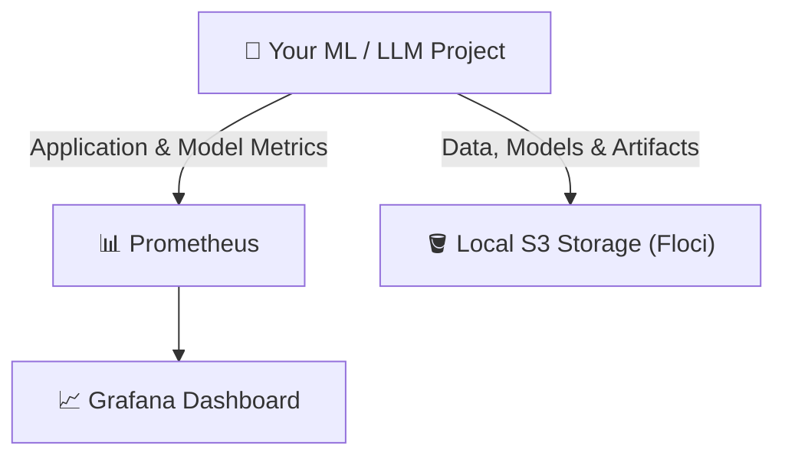
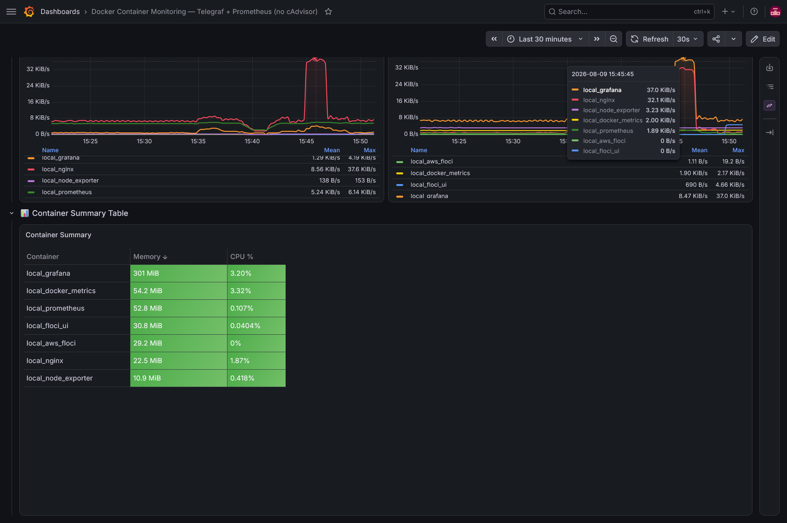
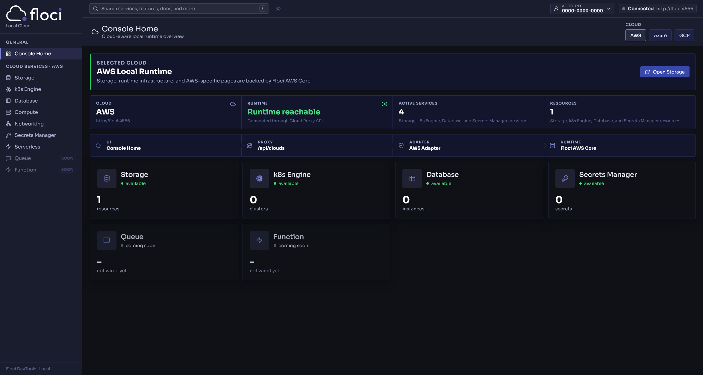
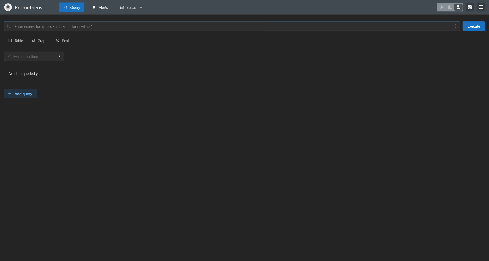

# Local MLOps Foundation

A lightweight local MLOps infrastructure foundation for building, experimenting with, and monitoring machine learning and LLM applications. It includes **user-friendly web UIs** such as **Grafana** for metrics monitoring and **Floci UI** for S3 storage management. Run S3-compatible workflows locally without an AWS account or cloud costs.


<a id="purpose"></a>
## 🎯 Project Purpose & Scope

This repository provides a pre-configured local infrastructure foundation for your ML and LLM projects:



Instead of spending hours setting up local S3 storage, Grafana dashboards, and container monitoring, clone this repository and build your ML/LLM pipelines **on top of it**.


<a id="what-you-get"></a>
## ✨ What You Get

| Component | Technology | Purpose |
| --- | --- | --- |
| **Local S3 Storage** | Floci (`:4566`) | S3-compatible object storage for datasets, model weights, and embeddings. |
| **S3 Management Web UI** | Floci UI (`:8080`) | Visual browser for inspecting buckets and object files. |
| **Metrics Visualization** | Grafana (`:80`) | Pre-loaded dashboards for real-time container and host hardware monitoring. |
| **Metrics Storage** | Prometheus (`:9090`) | Stores and queries application, container, and host metrics. |
| **Telemetry Collectors** | Telegraf & Node Exporter | Cross-platform container and host hardware metrics collectors (fully WSL2 compatible). |


<a id="quick-start"></a>
## 🚀 Quick Start

### 1. Prerequisites
- **Docker Engine & Docker Compose v2** installed.
- **AWS CLI v2** *(Optional, recommended for local S3 CLI testing).*

> [!NOTE]
> For step-by-step installation guides (Docker Engine WSL2, AWS CLI v2), see the **[Optional Documentation](#documentation)** section.

### 2. Start Infrastructure
Launch all services in detached mode:

```bash
docker compose up -d
```

### 3. Verify Health Status
Check container status (use `-a` to view all containers, including completed init workers):

```bash
docker compose ps -a
```

<details>
<summary>🔍 <b>View Expected Output</b></summary>

```text
NAME                   IMAGE                       COMMAND                  SERVICE          STATUS
local_aws_floci        floci/floci:1.6.0           "/usr/local/bin/dock…"   floci            Up (healthy)
local_dashboard_init   python:3.11-alpine          "python3 -c ..."         dashboard-init   Exited (0)
local_docker_metrics   telegraf:1.34.0-alpine      "/bin/sh -c 'cat <<..."  docker-metrics   Up (healthy)
local_floci_ui         floci/floci-ui:0.2.0        "./server"               floci-ui         Up
local_grafana          grafana/grafana:13.1.3      "/run.sh"                grafana          Up (healthy)
local_nginx            nginx:1.27.4-alpine         "/docker-entrypoint.…"   nginx            Up (healthy)
local_node_exporter    prom/node-exporter:v1.9.0   "/bin/node_exporter …"   node-exporter    Up (healthy)
local_prometheus       prom/prometheus:v3.2.1      "/bin/prometheus --c…"   prometheus       Up (healthy)
```

</details>


<a id="access-endpoints"></a>
## 🌐 Access Endpoints

| Service | Access URL | Default Credentials / Notes |
| --- | --- | --- |
| **Grafana Dashboard** | `http://localhost` | `admin` / `admin` (Pre-configured metrics dashboard) |
| **Floci S3 Web UI** | `http://localhost:8080` | S3 Management Console |
| **Local S3 Endpoint** | `http://localhost:4566` | S3 API (Key: `test` / Secret: `test` / Region: `us-east-1`) |
| **Prometheus Metrics** | `http://localhost:9090` | Direct PromQL query browser |


<a id="visual-dashboards"></a>
## 📊 Visual Dashboards

### 1. Grafana Telemetry Dashboard (`http://localhost`)
Pre-provisioned dashboard displaying real-time host RAM/CPU gauges, container memory bars, CPU time-series, and network bandwidth.


<details>
<summary>🔍 <b>Expand to view additional Grafana Panels (CPU, Network & Summary Table)</b></summary>

#### Container CPU & Network Performance


#### Container Summary Table


</details>


### 2. Floci S3 Web Console (`http://localhost:8080`)
Web interface for creating buckets, browsing folders, uploading, and downloading local S3 objects.




### 3. Prometheus Metrics & PromQL Browser (`http://localhost:9090`)

<details>
<summary>🔍 <b>Expand to view Prometheus Query Browser Preview</b></summary>

Direct PromQL query interface for inspecting metrics, evaluating target health, and testing time-series queries.



</details>


<a id="use-local-s3"></a>
## 🪣 Using Local S3 Storage & Code Integration

Interact with local S3 via AWS CLI or Python SDKs by pointing to `http://localhost:4566`:

### 1. AWS CLI Examples
```bash
# Create a bucket
aws --endpoint-url=http://localhost:4566 s3 mb s3://mlops-data

# List buckets
aws --endpoint-url=http://localhost:4566 s3 ls

# Upload datasets or model checkpoints
aws --endpoint-url=http://localhost:4566 s3 cp model.pt s3://mlops-data/v1/model.pt

# Download artifacts
aws --endpoint-url=http://localhost:4566 s3 cp s3://mlops-data/v1/model.pt ./model_downloaded.pt
```

### 2. Connect Your ML / LLM Project (Python / Boto3)
Connect your Python scripts, PyTorch models, or LangChain pipelines directly to local S3:

```python
import boto3

s3 = boto3.client(
    "s3",
    endpoint_url="http://localhost:4566",
    aws_access_key_id="test",
    aws_secret_access_key="test",
    region_name="us-east-1"
)

# Upload model weights or dataset splits
s3.upload_file("model.pt", "mlops-data", "v1/model.pt")
```

<a id="stop-reset"></a>
## 🛑 Stop / Reset Stack

### Stop Services (Preserve Data)
Stops containers while preserving all S3 bucket files, Prometheus metrics, and Grafana settings:

```bash
docker compose down
```

### ⚠️ Hard Reset (Delete All Stored Data)

```bash
docker compose down -v
```
> [!WARNING]
> Running this removes persistent Docker volumes and **permanently deletes** all stored S3 objects, datasets, model checkpoints, and Prometheus metrics.


<a id="documentation"></a>
## 📚 Optional Documentation

- [](./docs/architecture.md) : Technical deep dive into Docker Engine API integration, Prometheus scrape flow, `dashboard-init` worker, and volume persistence.
- [](./docs/docker-install-wsl.md) : Step-by-step guide to installing standalone Docker Engine natively on Windows WSL2.
- [](./docs/aws-cli-floci-setup.md) : Installing AWS CLI v2 and auto-routing commands to local Floci S3.


### 📦 Stack Technologies & Compatibility

[](https://docs.docker.com/compose/) [](https://prometheus.io/) [](https://grafana.com/) [](https://hub.docker.com/_/telegraf) [](https://github.com/prometheus/node_exporter) [](https://docs.python.org/3.11/) [](https://hub.docker.com/_/nginx) [](https://hub.docker.com/r/floci/floci) [](https://learn.microsoft.com/en-us/windows/wsl/)
