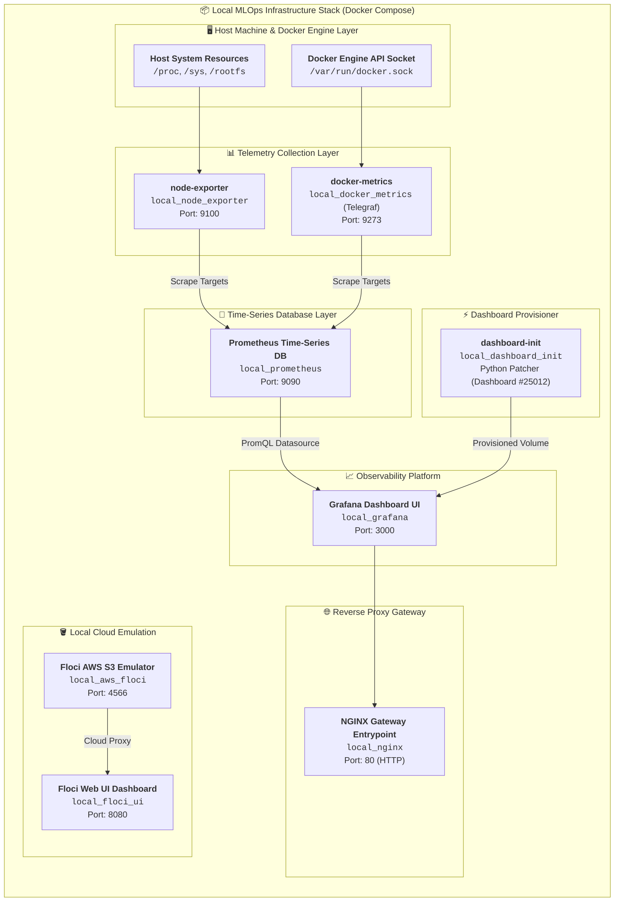

# Infrastructure Architecture & Implementation Reference

This document provides deep technical details, container interaction flows, and architectural design choices for MLOps and platform engineers extending or maintaining this local foundation.

---

## 🏗️ System Architecture & Data Flow

---

## 🔄 Component Interconnection Flow

1. **Host & Container Telemetry Extraction:**
   - `node-exporter` reads host system metrics directly via `/proc`, `/sys`, and `/rootfs` mounts.
   - `docker-metrics` (Telegraf Alpine container) mounts `/var/run/docker.sock` in read-only mode to capture real-time container metrics without cgroup driver conflicts (100% cgroup v2 & WSL2 compliant).
2. **Metrics Ingestion & Storage:**
   - `prometheus` scrapes metrics targets every 5 seconds (`scrape_interval: 5s`) from `node-exporter:9100`, `docker-metrics:9273`, and `localhost:9090`.
3. **Automated Dashboard Provisioning:**
   - `dashboard-init` downloads Grafana Dashboard `#25012` from the Grafana API, strips raw `${DS_*}` template variables, replaces datasource references with `Prometheus`, and outputs `docker_telegraf.json` into the `provisioned_dashboards` shared volume.
4. **Gateway & Reverse Proxy:**
   - NGINX routes external HTTP traffic on port `80` to Grafana (`local_grafana:3000`), allowing instant dashboard access without authentication prompts.
5. **Local Cloud & Object Emulation:**
   - Floci (`local_aws_floci`) provides S3 storage emulation on port `4566` backed by volume disk persistence (`floci_data`).
   - Floci UI (`local_floci_ui`) provides a web management interface on port `8080` for inspecting buckets and object keys.

---

## 🐳 Detailed Service & Container Registry

| Container Name | Service Key | Image | Port Mapping | Resource Limits | Purpose |
| --- | --- | --- | --- | --- | --- |
| `local_nginx` | `nginx` | `nginx:1.27.4-alpine` | `80:80` | CPU: 0.2, Mem: 128M | Reverse-proxy gateway routing traffic to Grafana UI. |
| `local_aws_floci` | `floci` | `floci/floci:1.6.0` | `4566:4566` | CPU: 1.0, Mem: 1G | Local AWS emulator supporting persistent S3 storage. |
| `local_floci_ui` | `floci-ui` | `floci/floci-ui:0.2.0` | `8080:8080` | CPU: 0.2, Mem: 128M | Web Management Console for Floci local S3 storage. |
| `local_docker_metrics` | `docker-metrics` | `telegraf:1.34.0-alpine` | Internal (`9273`) | CPU: 0.5, Mem: 256M | Pure Docker Engine API telemetry collector. |
| `local_node_exporter` | `node-exporter` | `prom/node-exporter:v1.9.0` | Internal (`9100`) | CPU: 0.2, Mem: 128M | Host hardware metrics collector (CPU, RAM, Disk IOPS). |
| `local_prometheus` | `prometheus` | `prom/prometheus:v3.2.1` | `9090:9090` | CPU: 1.0, Mem: 1G | Time-series database storing metrics data. |
| `local_grafana` | `grafana` | `grafana/grafana:13.1.3` | Internal (`3000`) | CPU: 0.5, Mem: 512M | Observability dashboard platform. |
| `local_dashboard_init` | `dashboard-init` | `python:3.11-alpine` | Ephemeral | CPU: 0.2, Mem: 128M | One-shot Python worker that patches Grafana dashboard JSON. |

---

## ℹ️ Grafana Standard vs. Grafana Slim

This repository uses **`grafana/grafana:13.1.3`**. Below is an evaluation of the standard build versus `grafana/grafana-slim`:

| Feature / Aspect | Standard (`grafana/grafana:13.1.3`) | Slim (`grafana/grafana-slim`) |
| :--- | :--- | :--- |
| **Bundled Plugins** | **Batteries-included:** Pre-packaged with built-in datasource & panel plugins (Prometheus, CloudWatch, Azure Monitor, Loki, etc.). | **Minimal:** Stripped of non-essential plugins to reduce image footprint. |
| **Download & Image Size** | Standard size (~350MB – 450MB compressed). | **~50% Smaller** (~150MB – 200MB compressed). |
| **Community Dashboards** | **100% Out-of-the-Box:** Guarantees instant rendering of imported community dashboards (e.g. Dashboard `#25012`) without missing panel errors. | May require dynamic runtime plugin downloads if a community dashboard references omitted visualization panels. |
| **Primary Use Case** | Local development, standard Docker Compose stacks, and general observability platforms. | Resource-constrained Kubernetes clusters, CI/CD runners, or edge devices. |

---

## 💾 Volume Persistence Breakdown

The Docker Compose stack uses 4 named persistent volumes:

- `floci_data`: Retains local S3 buckets, object data, and Floci emulator state (`PERSISTENCE=1`).
- `prometheus_data`: Preserves Prometheus time-series metrics data (TSDB).
- `grafana_data`: Stores Grafana configuration settings, users, and state.
- `provisioned_dashboards`: Caches the patched Grafana dashboard JSON generated by `dashboard-init`.
